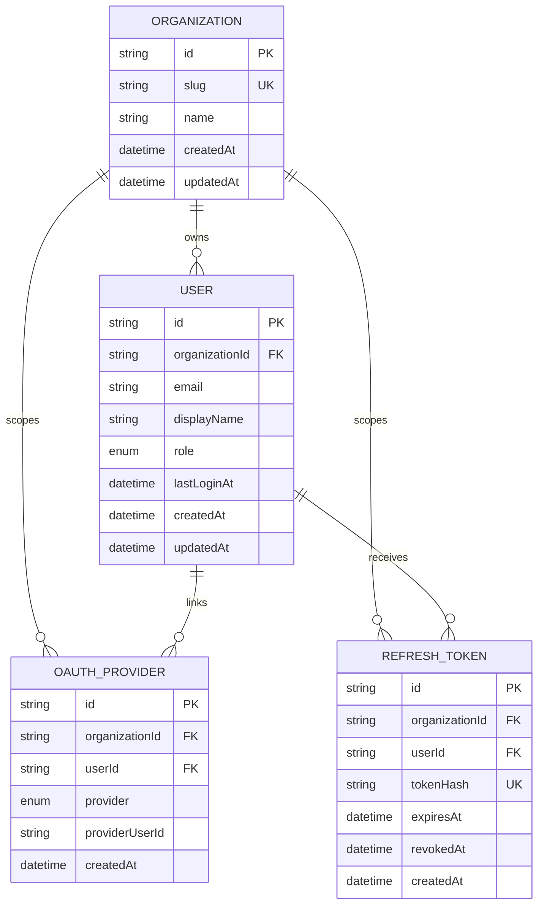

# Current Database Schema

> Last updated: 2026-07-25 (initial auth-aware bootstrap closeout)

Source of truth: [schema.prisma](../../packages/database/prisma/schema.prisma)

## Overview

The current schema covers the authentication and tenancy foundation for the application:

- every organization-owned record carries a direct `organizationId`
- users belong to exactly one organization
- OAuth identities are stored separately from users so one user can later support multiple providers
- refresh tokens are persisted as hashes so token rotation and revocation can be enforced server-side

There is no local-password credential table yet; the current schema supports provider-backed auth plus development bootstrap flows.

## Mermaid diagram

## Tables

### `organizations`

Represents the top-level tenant or household boundary for application data.

Key constraints:

- primary key: `id`
- unique: `slug`

### `users`

Represents an application user within exactly one organization.

Key constraints:

- primary key: `id`
- foreign key: `organizationId -> organizations.id`
- unique: `(organizationId, email)`
- indexed: `organizationId`

Notes:

- `role` is currently `admin` or `member`
- `lastLoginAt` records the last successful sign-in timestamp when available

### `oauth_providers`

Represents a verified provider identity linked to one user inside one organization.

Key constraints:

- primary key: `id`
- foreign keys:
  - `organizationId -> organizations.id`
  - `userId -> users.id`
- unique: `(organizationId, provider, providerUserId)`
- unique: `(organizationId, userId, provider)`
- indexed: `organizationId`
- indexed: `userId`

Notes:

- `provider` is currently `google`, `microsoft`, or `facebook`
- a single provider identity cannot be shared across organizations

### `refresh_tokens`

Represents persisted refresh tokens used for rotation and revocation.

Key constraints:

- primary key: `id`
- foreign keys:
  - `organizationId -> organizations.id`
  - `userId -> users.id`
- unique: `tokenHash`
- indexed: `organizationId`
- indexed: `userId`
- indexed: `expiresAt`

Notes:

- only hashed refresh tokens are stored
- `revokedAt` marks rotated or invalidated tokens without requiring deletion

## Relationship and scoping rules

- All organization-owned tables use direct `organizationId` scoping in line with [0001-organization-aware-data-access.md](../ADRs/0001-organization-aware-data-access.md).
- Protected API routes are expected to derive `organizationId` from verified JWT context rather than from client-supplied identifiers.
- User-to-organization membership is single-organization today, even though the overall architecture keeps room for later expansion.
