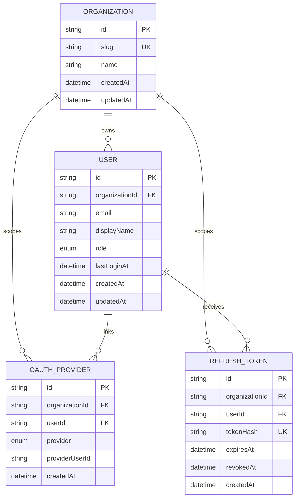

# Current Database Schema

> Last updated: 2026-07-25 (initial auth-aware bootstrap closeout)

Source of truth: [schema.prisma](../../packages/database/prisma/schema.prisma)

## Overview

The current schema covers the authentication and tenancy foundation for the application:

- every organization-owned record carries a direct `organizationId`
- users belong to exactly one organization
- OAuth identities are stored separately from users so one user can later support multiple providers
- refresh tokens are persisted as hashes so token rotation and revocation can be enforced server-side

There is no local-password credential table yet; the current schema supports provider-backed auth plus development bootstrap flows.

## Mermaid diagram

## Tables

### `organizations`

Represents the top-level tenant or household boundary for application data.

Key constraints:

- primary key: `id`
- unique: `slug`

### `users`

Represents an application user within exactly one organization.

Key constraints:

- primary key: `id`
- foreign key: `organizationId -> organizations.id`
- unique: `(organizationId, email)`
- indexed: `organizationId`

Notes:

- `role` is currently `admin` or `member`
- `lastLoginAt` records the last successful sign-in timestamp when available

### `oauth_providers`

Represents a verified provider identity linked to one user inside one organization.

Key constraints:

- primary key: `id`
- foreign keys:
  - `organizationId -> organizations.id`
  - `userId -> users.id`
- unique: `(organizationId, provider, providerUserId)`
- unique: `(organizationId, userId, provider)`
- indexed: `organizationId`
- indexed: `userId`

Notes:

- `provider` is currently `google`, `microsoft`, or `facebook`
- a single provider identity cannot be shared across organizations

### `refresh_tokens`

Represents persisted refresh tokens used for rotation and revocation.

Key constraints:

- primary key: `id`
- foreign keys:
  - `organizationId -> organizations.id`
  - `userId -> users.id`
- unique: `tokenHash`
- indexed: `organizationId`
- indexed: `userId`
- indexed: `expiresAt`

Notes:

- only hashed refresh tokens are stored
- `revokedAt` marks rotated or invalidated tokens without requiring deletion

## Relationship and scoping rules

- All organization-owned tables use direct `organizationId` scoping in line with [0001-organization-aware-data-access.md](../ADRs/0001-organization-aware-data-access.md).
- Protected API routes are expected to derive `organizationId` from verified JWT context rather than from client-supplied identifiers.
- User-to-organization membership is single-organization today, even though the overall architecture keeps room for later expansion.

---

## Approved Target Schema (Plan 0001, Pending Implementation)

### Overview (E-02 In Progress)

Plan 0001 (Portfolio Journal) has an approved persistence design document: [0001-portfolio-journal-design.md](0001-portfolio-journal-design.md). This section distinguishes the **approved target design** from the current **as-built schema** above.

**Status:** Design complete (T-02.1 done); migration applied (T-02.5 done, 2026-08-30).

### Implemented Additions

#### Table: `journal_entries` (T-02.5 migration applied ✓)

Represents a single Markdown entry for one user on one local calendar date.

**Implemented columns:**
- `id` (string, PK, CUID)
- `organizationId` (string, FK → organizations.id; direct scoping per ADR 0001)
- `userId` (string, FK → users.id; cascade delete)
- `localDate` (date, no time component; timezone-aware via client)
- `content` (text, canonical Markdown; never empty)
- `createdAt` (datetime, default now())
- `updatedAt` (datetime, auto-update)

**Implemented constraints:**
- Unique constraint: `(organizationId, userId, localDate)` — one entry per user per calendar day
- Primary key: `id`
- Foreign keys:
  - `organizationId` → `organizations.id` with `onDelete: Restrict`
  - `userId` → `users.id` with `onDelete: Cascade`

**Implemented indexes:**
- `(organizationId, userId, localDate)` — composite for day/week/month/all queries
- `organizationId` — org-scoped queries
- `userId` — user-scoped queries
- `localDate` — date range queries

**Lifecycle:**
- One entry per user per calendar day (enforced by uniqueness constraint)
- Move operation explicit; rejects destination if already occupied
- Delete cascades to user deletion (via `userId` FK)
- Org deletion protected (via `organizationId` FK with Restrict)

**Design details:** See [0001-portfolio-journal-design.md](0001-portfolio-journal-design.md)

**Migration applied:** `20260830_add_journal_entries` (via `prisma migrate dev`)

#### Forward Reference: `journal_entries_media` (E-05 design pending)

Image/screenshot embedding will be implemented in E-05 as:
- `id`, `organizationId`, `journalEntryId`, `mediaType`, `base64Data`, `sizeBytes`, `createdAt`
- Relationship: `journal_entries` 1:N `journal_entries_media`
- Cascade delete on entry deletion
- Size limits and storage constraints TBD in E-05 design

**Note:** Not implemented until E-05 task (T-05.x). T-02.1 documents the relationship shape; T-02.5 does not create the media table.

### Migration Schedule

- **T-02.5:** ✓ Created `journal_entries` table, indexes, constraints; implemented Prisma schema; applied migration (2026-08-30)
- **E-05 (T-05.x):** Design and implement `journal_entries_media` table with size limits, validation, storage strategy
