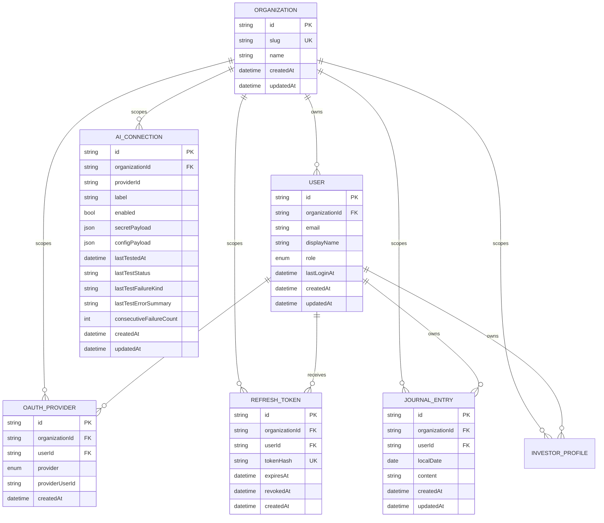

# Current Database Schema

> Last updated: 2026-09-06 (Personal Investor Profile closeout)

Source of truth: [schema.prisma](../../packages/database/prisma/schema.prisma)

## Overview

The current schema covers the authentication and tenancy foundation, private organization-scoped Journal entries, and organization-owned AI provider connections:

- every organization-owned record carries a direct `organizationId`
- users belong to exactly one organization
- OAuth identities are stored separately from users so one user can later support multiple providers
- refresh tokens are persisted as hashes so token rotation and revocation can be enforced server-side
- journal entries store canonical Markdown for one user and local calendar date
- AI provider connections store one provider credential set and configuration per organization-scoped label

There is no local password, PIN, or credential table. Passwordless local profiles are represented by `users` rows without linked `oauth_providers`, while hosted users must have at least one linked provider identity.

## Mermaid diagram

## Tables

### `organizations`

Represents the top-level tenant or household boundary for application data.

Key constraints:

- primary key: `id`
- unique: `slug`

### `users`

Represents an application user within exactly one organization.

Key constraints:

- primary key: `id`
- foreign key: `organizationId -> organizations.id`
- unique: `(organizationId, email)`
- indexed: `organizationId`

Notes:

- `role` is currently `admin` or `member`
- `lastLoginAt` records the last successful sign-in timestamp when available
- passwordless local household profiles use the same `users` table and do not require a linked `oauth_providers` row

### `oauth_providers`

Represents a verified provider identity linked to one user inside one organization.

Key constraints:

- primary key: `id`
- foreign keys:
  - `organizationId -> organizations.id`
  - `userId -> users.id`
- unique: `(organizationId, provider, providerUserId)`
- unique: `(organizationId, userId, provider)`
- indexed: `organizationId`
- indexed: `userId`

Notes:

- `provider` is currently `google`, `microsoft`, or `facebook`
- a single provider identity cannot be shared across organizations

### `refresh_tokens`

Represents persisted refresh tokens used for rotation and revocation.

Key constraints:

- primary key: `id`
- foreign keys:
  - `organizationId -> organizations.id`
  - `userId -> users.id`
- unique: `tokenHash`
- indexed: `organizationId`
- indexed: `userId`
- indexed: `expiresAt`

Notes:

- only hashed refresh tokens are stored
- `revokedAt` marks rotated or invalidated tokens without requiring deletion

### `journal_entries`

Represents one canonical Markdown Journal entry for one user on one local calendar date.

Key constraints:

- primary key: `id`
- foreign keys:
  - `organizationId -> organizations.id` with restrict deletion
  - `userId -> users.id` with cascade deletion
- unique: `(organizationId, userId, localDate)`
- indexed: `organizationId`, `userId`, `localDate`, and `(organizationId, userId, localDate)`

Notes:

- `localDate` uses PostgreSQL `DATE` semantics; the store boundary supplies UTC-midnight `Date` values to Prisma.
- `content` is canonical Markdown and must be non-blank at the application-validation boundary.
- Journal media is not part of the current schema and remains deferred to a future specification.

### `ai_connections`

Represents one organization-scoped AI provider connection containing a provider id, user-defined label, enable state, encrypted secret payload, and provider-specific non-secret configuration.

Key constraints:

- primary key: `id`
- foreign key: `organizationId -> organizations.id` with restrict deletion
- unique: `(organizationId, label)`
- indexed: `organizationId`

Notes:

- `providerId` is a registry-defined identifier and is not a database enum.
- `secretPayload` stores the encrypted crypto envelope only; plaintext secrets are never persisted.
- `configPayload` stores provider-specific non-secret configuration data such as deployment, endpoint, API version, or model selection.
- `lastTestStatus` is a nullable `success` or `failure` value; `lastTestFailureKind` and `lastTestErrorSummary` are only populated on failure.
- `consecutiveFailureCount` is retained across disable/enable cycles and reset only by a successful test or by a schema edit that invalidates prior test metadata.

### `investor_profiles`

Represents a Personal Investor Profile belonging to a specific user within an organization. Stores trading experience level, portfolio context, primary investment objectives, strategy presets, custom strategy overlay descriptions (Markdown), and free-form AI context (Markdown).

Key constraints:

- primary key: `id`
- foreign keys:
  - `organizationId -> organizations.id` with restrict deletion
  - `userId -> users.id` with cascade deletion
- unique: `(organizationId, userId)`
- indexed: `organizationId`, `userId`

Notes:

- `preferredName`, `experienceLevel`, `primaryObjective`, `customStrategyDescription`, and `freeformAiContext` are nullable string fields.
- `portfolioContext` and `strategyPresets` store JSON arrays of string keys loaded from repository runtime content or user selections.
- All fields are optional to support partial profile configuration.

## Relationship and scoping rules

- All organization-owned tables use direct `organizationId` scoping in line with [0001-organization-aware-data-access.md](../ADRs/0001-organization-aware-data-access.md).
- Protected API routes are expected to derive `organizationId` from verified JWT context rather than from client-supplied identifiers.
- User-to-organization membership is single-organization today, even though the overall architecture keeps room for later expansion.
- AI provider connections are organization-owned and intentionally shared by users/profiles in the same organization.

---

## Portfolio Journal schema implementation

### Overview

Plan 0001 (Portfolio Journal) has a persistence design document: [0001-portfolio-journal-design.md](0001-portfolio-journal-design.md). This section records the implemented Journal-specific schema details.

**Status:** Implemented by migration `20260830_add_journal_entries`.

### Implemented Additions

#### Table: `journal_entries` (T-02.5 migration applied ✓)

Represents a single Markdown entry for one user on one local calendar date.

**Implemented columns:**
- `id` (string, PK, CUID)
- `organizationId` (string, FK → organizations.id; direct scoping per ADR 0001)
- `userId` (string, FK → users.id; cascade delete)
- `localDate` (date, no time component; timezone-aware via client)
- `content` (text, canonical Markdown; never empty)
- `createdAt` (datetime, default now())
- `updatedAt` (datetime, auto-update)

**Implemented constraints:**
- Unique constraint: `(organizationId, userId, localDate)` — one entry per user per calendar day
- Primary key: `id`
- Foreign keys:
  - `organizationId` → `organizations.id` with `onDelete: Restrict`
  - `userId` → `users.id` with `onDelete: Cascade`

**Implemented indexes:**
- `(organizationId, userId, localDate)` — composite for day/week/month/all queries
- `organizationId` — org-scoped queries
- `userId` — user-scoped queries
- `localDate` — date range queries

**Lifecycle:**
- One entry per user per calendar day (enforced by uniqueness constraint)
- Move operation explicit; rejects destination if already occupied
- Delete cascades to user deletion (via `userId` FK)
- Org deletion protected (via `organizationId` FK with Restrict)

**Design details:** See [0001-portfolio-journal-design.md](0001-portfolio-journal-design.md)

**Migration applied:** `20260830_add_journal_entries` (via `prisma migrate dev`)

#### Deferred: `journal_entries_media`

Image/screenshot embedding is deferred to a dedicated future specification and may use:
- `id`, `organizationId`, `journalEntryId`, `mediaType`, `base64Data`, `sizeBytes`, `createdAt`
- Relationship: `journal_entries` 1:N `journal_entries_media`
- Cascade delete on entry deletion
- Size limits and storage constraints to be defined by the future media specification

**Note:** This table is not implemented in the current schema.

### Migration Schedule

- **T-02.5:** ✓ Created `journal_entries` table, indexes, constraints; implemented Prisma schema; applied migration (2026-08-30)
- **Future media specification:** Design and implement `journal_entries_media` with size limits, validation, and storage strategy
